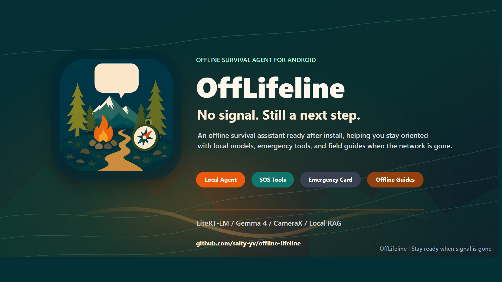

# OffLifeline

<p align="center">
  
</p>

<p align="center">
  <a href="./README.zh-CN.md">简体中文</a> | <strong>English</strong>
</p>

<p align="center">
  
</p>

## Overview

OffLifeline is an offline survival assistant for Android. It is not a cloud chatbot, a medical diagnosis product, or a rescue dispatch system. Its purpose is to keep conservative, actionable next-step guidance available on the phone when the user has no signal, low battery, an injury, bad weather, a disaster, or an outdoor emergency.

The app is built with Kotlin and Jetpack Compose. Its main experience is a conversational survival agent: the user can send text and local images, the app retrieves relevant guidance from an embedded offline knowledge base, Gemma / LiteRT-LM generates a step-by-step response locally, and a safety layer validates the answer before it is shown.

## Highlights

- Offline-first design: guidance, tools, and local inference are designed around no-network situations.
- Conversational agent: asks key follow-up questions and adjusts advice across turns.
- Local RAG knowledge base: Markdown survival guides are packaged into a SQLite FTS database.
- Multimodal input: camera and gallery images are preprocessed locally before inference.
- Safety layer: conservative constraints for high-risk topics such as poisoning, snake bite, floodwater, fire, and severe bleeding.
- Local toolbox: SOS flashlight, screen SOS, battery-saving advice, emergency card, offline guides, and debug log export.
- Bilingual UI: in-app switching between Chinese and English.
- Build flavors: `lite` for lightweight development and model-selection workflows, `bundled` for an offline package with a local model asset.

## Architecture

The system is split into six layers: Compose UI, Agent Runtime, SQLite FTS offline RAG, LiteRT-LM inference, safety constraints, and local storage/device tooling. This keeps the model responsible for understanding, reasoning, and generation, while deterministic code handles retrieval, state, device tools, and hard safety boundaries.

The agent does not pass a raw user message directly to the model. It first summarizes recent conversation history, detects risk domains such as lost outdoors, low battery, bleeding, flood, fire, or thunderstorm, selects key follow-up questions, recommends local tools, retrieves up to 5 offline guide chunks, and injects role, language, image rules, local references, and safety constraints into the prompt.

## Model and Offline Knowledge Base

The `bundled` build flavor uses `Gemma-4-E2B-it-litert-lm` as the primary local model, stored under `app/src/bundled/assets/models/`. At runtime, `ModelAssetManager` searches app model storage, persisted external references, and bundled assets, then verifies file size and SHA-256 before loading.

Offline guide sources live under `app/src/main/assets/guides_src/`, grouped by device, disaster, medical, and navigation topics. The generated `offline_guides.db` contains `guides`, `guide_chunks`, and `guide_chunks_fts` tables; the current embedded knowledge base contains 26 guides and 78 FTS chunks. Retrieval combines keyword extraction, query expansion, topic-targeted FTS, and risk-domain fallback retrieval, then merges and deduplicates results with `RankFusion`.

## Design Tradeoffs

OffLifeline is built around a hard set of constraints: no network, conservative advice, limited battery, and high consequences for bad guidance. That is why it uses on-device LiteRT-LM inference, SQLite FTS retrieval, short context summaries, a maximum of 3 image attachments, cancellable generation, and a deterministic Safety Kernel.

It is not meant to replace professional rescue. It is meant to help the user find a safer next step when online help is unavailable.

## Tech Stack

- Android / Kotlin
- Jetpack Compose / Material 3
- LiteRT-LM
- Gemma-4-E2B-it / Gemma-4-E4B-it model manifests
- Room / SQLite FTS
- DataStore
- CameraX
- WorkManager
- OkHttp

## Project Layout

```text
app/src/main/java/com/example/offlinelifeline/
  agent/          Agent runtime, risk detection, question planning, tool routing, prompts
  inference/      LiteRT-LM, model catalog, integrity checks, download and runtime state
  safety/         Risk-specific constraints and output validation
  data/           Room database, repositories, DataStore settings
  device/         Battery, flashlight, and local image preprocessing
  ui/             Compose screens: chat, toolbox, guides, emergency card, settings

app/src/main/assets/
  guides_src/     Offline guide Markdown sources
  databases/      Generated offline_guides.db

app/src/bundled/assets/models/
  Local model directory for bundled builds; *.litertlm is ignored by Git by default
```

## Build and Run

Open the project in Android Studio, or build from the command line:

```bash
./gradlew assembleLiteDebug
```

On Windows:

```powershell
.\gradlew.bat assembleLiteDebug
```

The debug APK is usually generated at:

```text
app/build/outputs/apk/lite/debug/app-lite-debug.apk
```

To build the model-bundled flavor, place a LiteRT-LM model file at:

```text
app/src/bundled/assets/models/gemma-4-E2B-it.litertlm
```

Then run:

```bash
./gradlew assembleBundledDebug
```

On Windows:

```powershell
.\gradlew.bat assembleBundledDebug
```

Note: model files are usually larger than 2 GB. This repository ignores `*.litertlm`, `*.task`, and `*.apk` files through `.gitignore`. For a public GitHub repository, provide the model through Releases, an external download link, or clear setup instructions instead of committing it directly.

## Model Placement Note

The in-app interrupted download / resume-download flow for large model files has not been fully tested. For a more reliable setup, place the model file in the app's external model folder, or use the app's model move/import feature from the settings screen.

Recommended external folder:

```text
/storage/emulated/0/Android/data/<applicationId>/files/models/
```

Common package-specific paths:

```text
/storage/emulated/0/Android/data/com.example.offlinelifeline/files/models/
/storage/emulated/0/Android/data/com.example.offlinelifeline.lite/files/models/
/storage/emulated/0/Android/data/com.example.offlinelifeline.bundled/files/models/
```

Expected model filename:

```text
gemma-4-E2B-it.litertlm
```

## Safety Scope

OffLifeline provides offline self-help guidance only. It does not replace professional rescue, medical diagnosis, first-aid training, or official disaster instructions. When a network or other communication channel is available, contact local emergency services, rescue teams, or medical professionals first.

## Docs

- [Kaggle / project write-up](doc/kaggle_writeup_offlifeline.md)
- [Technical design notes](doc/offline_survival_agent_technical_doc_revised.md)
- [RAG migration plan](doc/rag_migration_plan.md)
